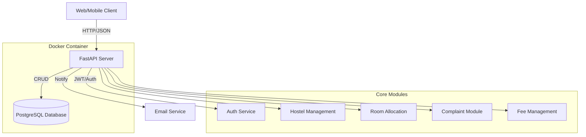

# 🏨 Smart Hostel Management API - Production Ready Backend

A feature-rich, scalable backend for university hostels and residential facilities built with **FastAPI**, **PostgreSQL**, and **Docker**.

## 🏗️ Architecture Diagram



## 🚀 Deployment & Execution

### 1. Using Docker (Recommended)
The system is containerized for easy deployment. Ensure you have Docker and Docker Compose installed.

```bash
docker-compose up --build
```
The API will be available at `http://localhost:8000`.

### 2. Manual Setup
If you prefer running it locally without Docker:

1. **Install Dependencies**:
   ```bash
   pip install -r requirements_hostel.txt
   ```

2. **Configure Environment**:
   Update `.env` with your PostgreSQL or email credentials.

3. **Run Server**:
   ```bash
   uvicorn app.main:app --reload
   ```

## 🔐 Core Features & API Endpoints

### 🛡️ User & Auth
- **POST `/auth/signup`**: Register with role-based access.
- **POST `/auth/verify`**: Verify email using UUID token.
- **POST `/auth/login`**: JWT-based secure login.

### 🏢 Hostel & Room Management
- **POST/GET `/hostels`**: Manage hostel buildings.
- **POST/GET `/rooms`**: Manage rooms and link to hostels.
- **POST `/rooms/{id}/allocate`**: Intelligent room allocation with vacancy tracking.

### 📝 Complaints & Notifications
- **POST `/complaints`**: Students raise maintenance issues.
- **PATCH `/complaints/{id}`**: Wardens update status and assign staff.
- **Automatic Emails**: Notifications sent for signup, allocation, and complaint updates.

### 💰 Fee Management
- **POST/GET `/payments`**: Track hostel fees and payment history.

## 🔑 Demo Credentials
- **Admin**: `admin@hostel.com` / `admin123`
- **Warden**: `warden@hostel.com` / `warden123`
- **Student**: `student@hostel.com` / `student123`

## 📖 API Documentation
- **Swagger UI**: [http://localhost:8000/docs](http://localhost:8000/docs)
- **ReDoc**: [http://localhost:8000/redoc](http://localhost:8000/redoc)

## 🛠️ Tech Stack
- **FastAPI**: Modern, high-performance web framework.
- **SQLAlchemy**: Powerful Python SQL Toolkit and ORM.
- **PostgreSQL**: Production-grade relational database.
- **Docker**: For seamless environment orchestration.
- **JWT**: Secure token-based authentication.
